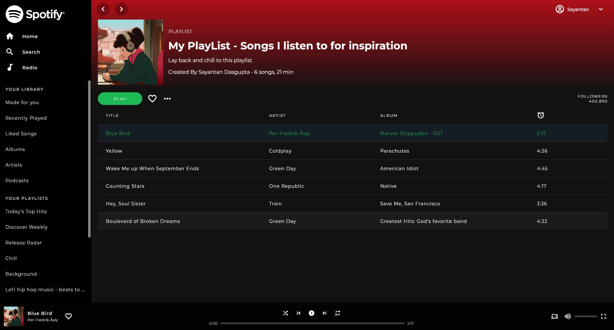

### Spotify UI Clone

This UI clone has been made by to learn about how to build realistic and responsive UI using Flutter.

I created this UI by following the tutorial of [Marcus NG](https://www.youtube.com/watch?v=HJ1AlSrgZVQ).

The UI that has been created is shown below.

| Screen | Image |
| ------ | ----- |
| Playlist Screen |  |